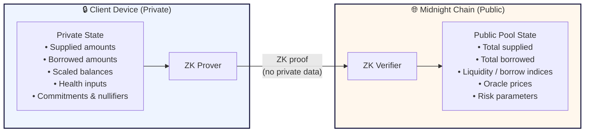
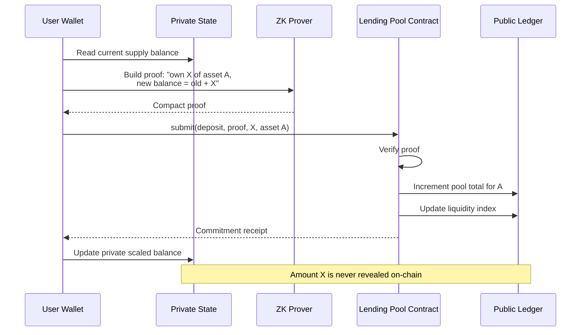
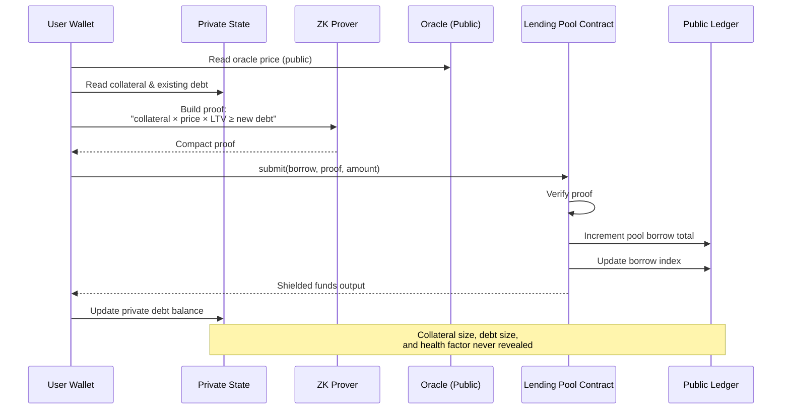
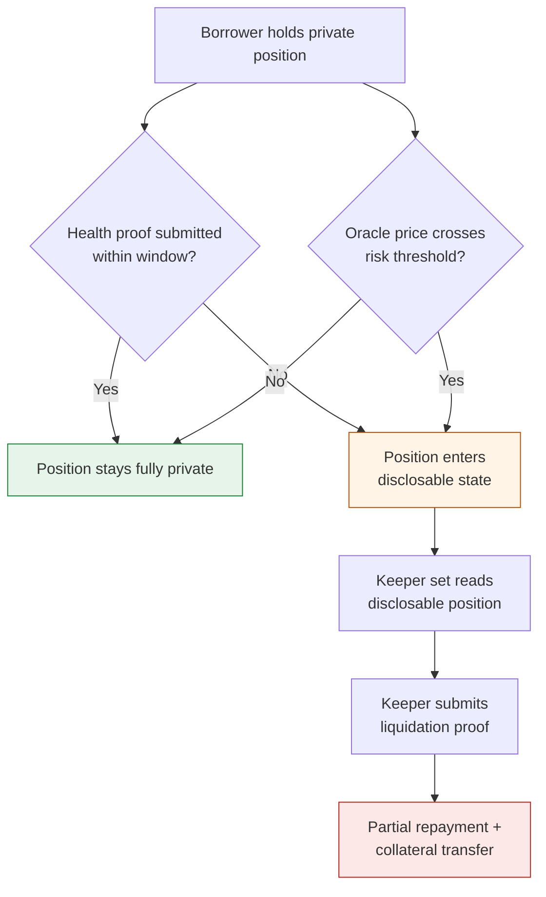

# lending-borowing-app

A Midnight Network application created with `create-mn-app`.

---
## Privacy Architecture Overview

*A private lending and borrowing protocol built on Midnight*

### Context

This document outlines how the protocol uses Midnight's privacy primitives to deliver a lending and borrowing market where user positions remain confidential while pool-level state stays publicly verifiable. The design follows the same economic model as established DeFi money markets, but lifts per-user collateral, debt, and health data off the public ledger.

> **Note on repository status**
>
> The implementation has been independently tested end-to-end. The full flow depends on contract-to-contract calls (C2C). Until C2C lands, some cross-contract boundaries are stubbed locally for testing — they will be replaced with real on-chain calls once C2C ships.

### Architecture at a glance

State is split cleanly into two layers. Anything the market needs to agree on globally lives in public state. Anything tied to an individual user lives in private state on that user's device.

| Public state (on-chain) | Private state (client-side) |
|---|---|
| Total supplied per asset | User's supplied amounts per asset |
| Total borrowed per asset | User's borrowed amounts per asset |
| Utilization and interest rate indices | Scaled balances for interest accrual |
| Oracle prices | Position health inputs |
| Reserve factor and risk parameters | Commitments and nullifiers |

### Privacy primitives in use

**Zero-knowledge proofs.** Every user action — deposit, borrow, withdraw, repay — is accompanied by a zk-SNARK proof that the state transition is valid. Validators verify the proof without seeing balances, positions, or the collateral-to-debt ratio behind it.

**Compact with explicit disclosure.** Contracts are written in Compact, where privacy is the default. Any disclosure of private data must be declared explicitly in the circuit, which eliminates a whole class of accidental leaks common in Solidity-style development.

**Shielded UTXOs (Zswap).** Collateral and borrowed funds move as shielded commitments rather than visible account balances. This covers the asset-movement side of privacy, while the protocol circuits handle position-level privacy.

**Public indices, private scaled balances.** Interest accrual uses the Aave-style index model. Liquidity and borrow indices are public and update on every interaction. Each user holds a private scaled balance, and the current balance is recovered by multiplying the private scaled balance by the public index. The math is unchanged; only the principal is hidden.

**Viewing keys (roadmap).** Viewing keys enable opt-in, read-only disclosure to auditors, regulators, or institutional counterparties — a compliance pathway that transparent DeFi structurally cannot offer.

### Deposit flow

### Borrow flow

### User flow summary

| Action | What the ZK proof asserts | Public effect |
|---|---|---|
| **Deposit** | Caller owns and commits X of asset A; private supply balance increases by X. | Pool total for A increments by X; liquidity index updates. |
| **Borrow** | Collateral value at oracle price ≥ required coverage for new debt. | Pool borrow total increments; borrow index updates. |
| **Withdraw** | Remaining collateral after withdrawal still covers outstanding debt. | Pool total for A decrements. |
| **Repay** | Caller reduces a valid debt commitment by X. | Pool borrow total decrements. |

### Liquidation design

Liquidations are the genuinely hard problem in a private money market: the system needs to act on unhealthy positions without making all positions globally visible. The current approach combines periodic health proofs from borrowers with conditional disclosure triggered by oracle movements, allowing a keeper set to act on positions that drop below threshold.

This remains an active area of design and will be refined as C2C unlocks richer contract interactions.

### Development stack

- **Compact** — circuit and contract logic for deposit, borrow, withdraw, repay.
- **compact-runtime** — `StateMap`, `StateBoundedMerkleTree` for commitments, persistent/transient commitment primitives.
- **midnight.js** — contract deployment, discovery, call submission from the application layer.
- **dapp-connector-api** — wallet integration and signing.
- **Indexer (GraphQL)** — public state queries and real-time subscriptions for contract actions and transaction events.
- **Ledger API** — fine-grained construction of shielded offers when needed.

### Dependency on contract-to-contract calls

Several core interactions — notably those that need one circuit to atomically invoke another within a single transaction — depend on C2C to work cleanly on-chain. The current implementation stubs these boundaries locally for testing. Once C2C is available, the stubs are replaced with real cross-contract calls.

### Next steps

- Integrate C2C as soon as it ships and migrate the test harness to on-chain flows.
- Finalize the liquidation mechanism and publish its security rationale.
- Scope viewing-key integration for an institutional pilot.
